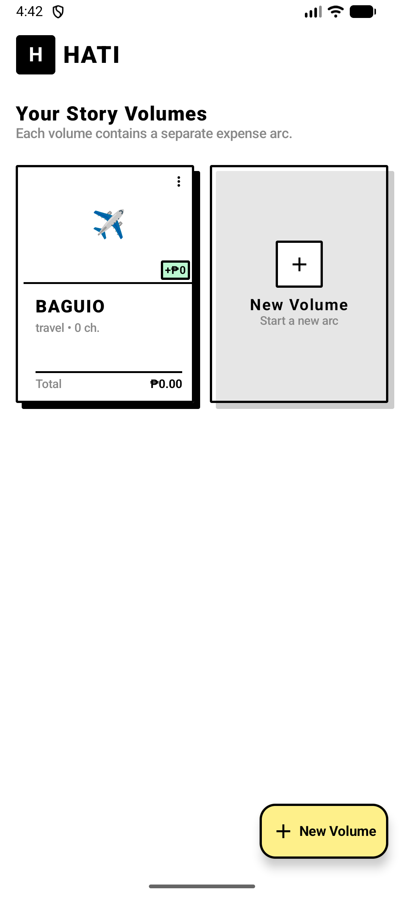

# HATI² (HATI_v2)

> **Handy All-round Transaction Interface, version 2** — A high-performance, offline-first expense management app built with the **Manga x Notion** design aesthetic. Track expenses, manage party balances, and settle up with speed and style.


---

## 🎨 Design System: Manga x Notion

HATI² features a unique visual language that combines the bold, high-contrast energy of Shonen Manga with the clean, minimalist utility of Notion.

- **Manga Elements**: Heavy black borders (`MangaBlack`), hard shadows, sharp corners, and high-impact typography.
- **Notion Palette**: Soft, pastel category colors (`NotionYellow`, `NotionBlue`, `NotionRed`, `NotionGreen`, `NotionPurple`) for high readability.
- **Antigravity Experience**: Micro-animations and responsive layouts that keep the interface feeling light and "alive."

For the full UI/UX design reference — including color theory, typography rules, cinematography principles applied to layouts, motion design, and the design decision framework — see **[DESIGN.md](DESIGN.md)**.

---

## 📸 Screenshots

### Hub List — Your Story Volumes
> Current checked-in capture of the home screen. This is the starting point for every usability pass.

<p align="center">
  
</p>

What you are seeing:
- **Volume cards** — one card per dashboard, styled like manga volumes for fast visual scanning
- **Type icon + colored spine** — quick identity cues for travel, household, and event dashboards
- **Balance tag** — instant signal for whether your current position is positive or negative
- **⋮ menu** — edit and delete actions kept off the main tap target so opening a volume stays simple
- **+ New Volume** — the primary action stays pinned in the FAB and duplicated by the ghost card

Why it works like that:
- The grid keeps multiple dashboards visible at once, which reduces navigation depth.
- Strong borders, shadows, and color accents make each volume feel tappable without needing extra labels.
- The empty-state card and FAB both point to the same creation flow, so first-run and repeat use share one mental model.

> **Current screenshot coverage:** this repository currently includes the real Hub List capture above. The remaining screens are documented below from the current source and test flow so ongoing testing has a clear map of what each screen is doing.

---

## 🧪 Usability Test Notes

### Test method
- Reviewed the current navigation flow in `MainActivity.kt`
- Traced each primary Compose screen to document what the user sees and why each interaction behaves that way
- Cross-checked the intended happy path against `app/src/androidTest/java/com/hativ2/ui/AppE2ETest.kt`

### Environment note
- A fresh Gradle test run currently stops before execution because the Android Gradle Plugin version declared by the project could not be resolved in this environment.
- Because of that, this pass documents the present UX from the checked-in UI and navigation code plus the existing E2E flow, rather than from a new emulator capture session.

### Current user flow

#### 1. Hub List / Dashboard List
**What it is doing:** shows all dashboards, creation entry points, and per-volume quick actions.  
**How it works:** `DashboardListScreen` collects `dashboardsWithStats`, renders them in an adaptive grid, and opens add/edit/delete dialogs inline.  
**Why it works like that:** the home screen is acting as a control center, so creation and management stay one tap away instead of being buried in a settings page.

#### 2. Create a New Volume
**What it is doing:** lets the user create a new expense space with a title, type, and theme color.  
**How it works:** both the FAB and the ghost “new volume” card open `AddDashboardDialog`, then `MainViewModel.createDashboard(...)` updates the grid and shows a snackbar.  
**Why it works like that:** duplicate entry points remove dead ends; whether the list is empty or full, the same dialog appears and the same feedback pattern is used.

#### 3. Dashboard Detail
**What it is doing:** acts as the hub for one dashboard by showing balance, transactions, members, settlement actions, and export.  
**How it works:** `DashboardDetailScreen` subscribes to dashboard, people, expense, transaction, and debt-summary flows, then composes a single scrolling overview.  
**Why it works like that:** keeping the dashboard summary on one page lowers context switching; users can inspect status, act, and confirm outcomes without hopping through multiple tabs first.

#### 4. Add Expense
**What it is doing:** captures a new expense or edits an existing one, including payer and split participation.  
**How it works:** `AddExpenseScreen` keeps form state locally, validates description/amount/split selection before save, and defaults the split to all known participants on first load.  
**Why it works like that:** the screen optimizes for the common case—shared expenses—so users do less manual setup, while still stopping invalid totals before anything is saved.

#### 5. History
**What it is doing:** shows a searchable transaction log and supports export.  
**How it works:** `HistoryScreen` pulls all transactions, filters them by volume/search/category, and exposes CSV/JSON export through the system file picker.  
**Why it works like that:** the log is designed as an audit trail, so filtering and export are placed close to the list rather than hidden behind secondary menus.

#### 6. Charts
**What it is doing:** summarizes spending with totals, category breakdown, monthly trend, and month-over-month change.  
**How it works:** `ChartsScreen` aggregates current expenses into category totals and six-month monthly totals, then renders cards and charts from those derived values.  
**Why it works like that:** analytics are computed from the same stored expense data the rest of the app uses, so the charts reinforce the detail screens instead of introducing a separate reporting model.

#### 7. Export
**What it is doing:** creates a manual backup of the selected dashboard.  
**How it works:** export starts from the detail or history toolbar, shows `ExportWarningDialog`, then launches the Storage Access Framework document picker for CSV or JSON output.  
**Why it works like that:** using the system picker gives the user explicit control over where files go and avoids silent writes into app-private storage.

### Current usability observations
- The overall flow is understandable: Hub List → Dashboard Detail → Add Expense / History / Charts.
- The design language is consistent across screens: thick borders, shadowed cards, accent colors, and high-contrast labels keep primary actions recognizable.
- Validation is front-loaded on the expense form, which should reduce bad data entry during real-world use.
- There is a navigation gap in the current implementation: `BalanceScreen` and `ExpenseListScreen` exist, but the main dashboard actions currently route to **History** and **Charts** from `MainActivity`, so those two dedicated routes are not part of the primary reachable flow right now.

---

## 🚀 Key Features

- **Dashboard "Hubs"** — Manage multiple "Volumes" (dashboards) for different travel arcs, households, or events.
- **Advanced Debt Calculation** — Automated split logic with "Settle Up" history and real-time dashboard stats.
- **Unified UI Architecture** — Standardized components (`MangaCard`, `TransactionCard`, `MangaTextField`) ensured across all screens for a seamless experience.
- **Performance Optimized** — Smooth scrolling and stable recompositions using efficient state management.
- **100% Offline-First** — Local data persistence with Room. Your data stays on your device.

---

## 🛠️ Tech Stack

| Layer | Technology |
|---|---|
| **Architecture** | Clean Architecture + MVVM + Usecases |
| **UI Framework** | Jetpack Compose (Modern BOM) |
| **DI** | Hilt (Dagger) |
| **Storage** | Room (SQLite) |
| **Concurrency** | Kotlin Coroutines & Flow |
| **Testing** | JUnit 4, Kotlin-test, Hilt Testing |

---

## 📖 Architecture Overview

The codebase is organized into three distinct layers to ensure testability and scalability:

```text
app/src/main/java/com/hativ2/
├── data/        # Room Database, DAOs, Repository Implementations
├── domain/      # Pure business logic, Usecases, Repository Interfaces
└── ui/          # Compose Screens, ViewModels, Theme, Shared Components
```

---

## ✅ Progress Roadmap

- [x] **v2.0 Core** — Migration to Clean Architecture & Room.
- [x] **Design Unification** — Standardization of all components to the Manga x Notion tokens.
- [x] **Color Audit** — Replacement of all hardcoded colors with standardized `Notion*` constants.
- [x] **Smart Calculation** — Implementation of `CalculateDebtsUseCase` and `Settle Up` logic.
- [x] **Chart Enhancements** — Advanced spending analytics: category percentage breakdown, monthly average line, month-over-month trend indicator.
- [x] **Data Export** — CSV and JSON export for manual backups with format selection and security warning.
- [ ] **Cloud Sync** — Opt-in Supabase synchronization for multi-user party tracking.

---

## ⚙️ Setup & Installation

### 1. Clone the Repository
```bash
git clone https://github.com/P1xellzxc/HATI_v2.git
cd HATI_v2
```

### 2. Requirements
- Android Studio **Iguana** (2023.2.1) or later
- JDK **17**
- Minimum SDK: **26** (Android 8.0)

### 3. Build and Run
1. Open the project in Android Studio.
2. Click **File → Sync Project with Gradle Files**.
3. Select your device or emulator and click **Run ▶**.

---

## 📜 License

This project is licensed under the **MIT License** — see the [LICENSE](LICENSE) file for details.
