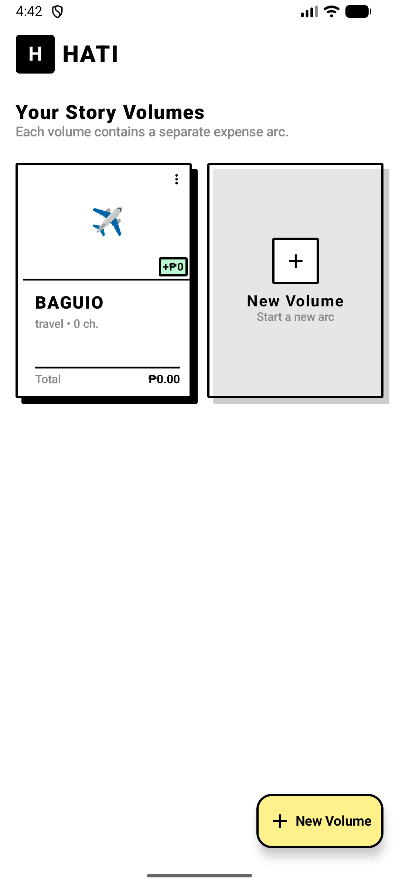
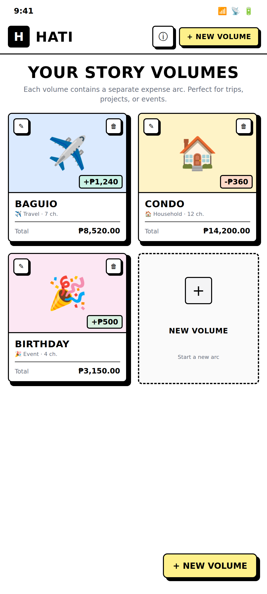
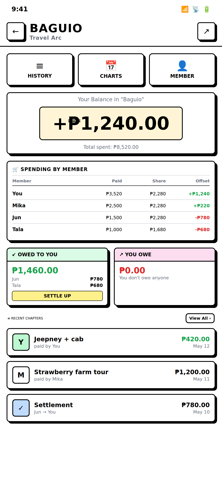
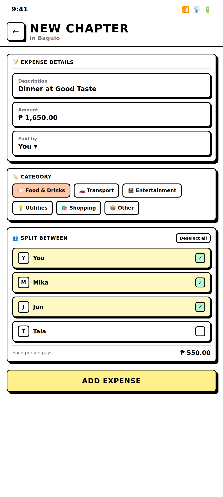
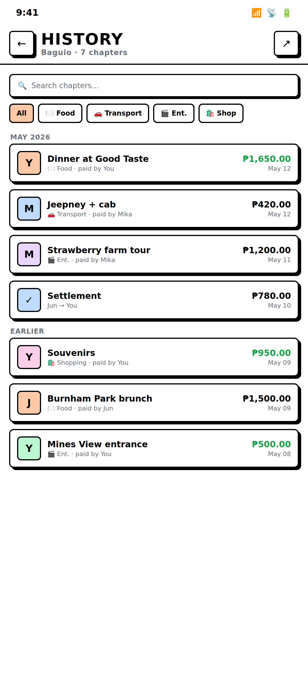
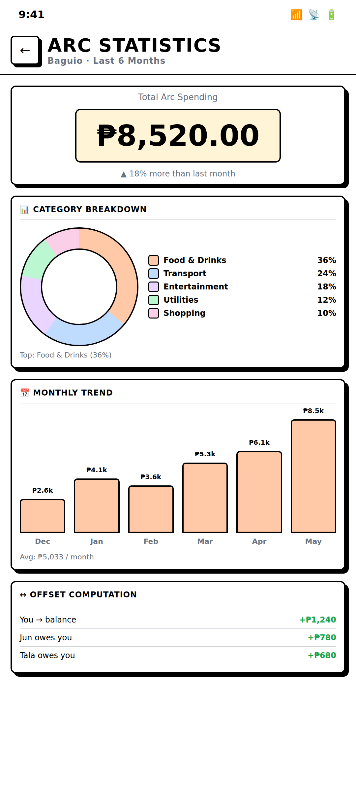

# HATI² (HATI_v2)

> **Handy All-round Transaction Interface, version 2** — A high-performance, offline-first expense management app built with the **Manga x Notion** design aesthetic. Track expenses, manage party balances, and settle up with speed and style.


---

## 🎨 Design System: Manga x Notion

HATI² features a unique visual language that combines the bold, high-contrast energy of Shonen Manga with the clean, minimalist utility of Notion.

- **Manga Elements**: Heavy black borders (`MangaBlack`), hard shadows, sharp corners, and high-impact typography.
- **Notion Palette**: Soft, pastel category colors (`NotionYellow`, `NotionBlue`, `NotionRed`, `NotionGreen`, `NotionPurple`) for high readability.
- **Antigravity Experience**: Micro-animations and responsive layouts that keep the interface feeling light and "alive."

For the full UI/UX design reference — including color theory, typography rules, cinematography principles applied to layouts, motion design, and the design decision framework — see **[DESIGN.md](DESIGN.md)**.

---

## 📸 Screenshots

> Two kinds of screenshot live in this repo:
> - **`hub_final.png`** is a real Android device capture of the empty Hub state.
> - **`docs/screenshots/*.png`** are 1080×2400 HTML mockups generated by `tools/screenshots/render.js` from the exact design tokens in `Color.kt` and the copy in `strings.xml`. They give a populated walkthrough of the app without requiring an emulator. See **[Regenerating the screenshots](#regenerating-the-screenshots)** for how they are produced.

### Sample usage flow

Follow the captures in order to see how a typical Baguio trip is tracked end-to-end — from creating a volume to settling up.

#### 1. Hub List — Your Story Volumes
Your home screen. Each card is a separate expense arc (a trip, household, event). The colored spine + emoji acts as a quick identity cue; the corner balance tag tells you at a glance whether you are owed money or owe money in that arc.

<p align="center">
  
  &nbsp;
  
</p>

*Left: the real first-run state from `hub_final.png`. Right: the same screen populated with sample volumes (Baguio trip, condo expenses, birthday party).*

**Try it:** tap the yellow **+ NEW VOLUME** button (top-right or bottom-right FAB) to open the create dialog, pick a title, type, and theme color, then tap **Add**. The new volume slides into the grid and a snackbar confirms.

#### 2. Dashboard Detail — One Volume
Tap a volume card to drill in. The screen centers a single cream **balance pill** (the focal point), then walks down through quick-action tiles, a member-by-member spending table, owed/owe summary cards, and the most recent transactions.

<p align="center">
  
</p>

**Try it:**
- Tap **HISTORY** / **CHARTS** / **MEMBER** in the top row to jump to those screens or add a participant.
- Tap **SETTLE UP** in the "OWED TO YOU" card to record a payment between two people — the balances and the transactions list update immediately.
- Tap the ↗ icon in the top bar to export this volume as CSV or JSON.

#### 3. Add Expense — A New Chapter
Reachable from the dashboard FAB. The form validates description, amount, category, and split selection before allowing **ADD EXPENSE**. By default the split includes everyone in the volume (so the common case is one tap away), and the running "Each person pays" preview updates as you toggle members.

<p align="center">
  
</p>

**Try it:** type a description, type an amount, pick a category chip, toggle participants on/off, and tap **ADD EXPENSE**. The screen pops back to the dashboard with the new entry at the top of *Recent Chapters*.

#### 4. History — Searchable Transaction Log
Every expense and settlement ever recorded in this volume, grouped by month. The search bar filters in real time; the chip row filters by category. The ↗ icon exports the filtered view.

<p align="center">
  
</p>

**Try it:** type "burnham" into the search box to filter to one row. Tap **Food** in the chip row to keep only restaurant entries. Tap a row to edit or delete the chapter.

#### 5. Charts — Arc Statistics
Aggregations over the volume's expenses: total spent (the focal cream pill again), category donut, six-month trend bars, and an offset table showing who is up or down across the whole arc. Numbers are computed from the same expense store, so they always agree with the dashboard.

<p align="center">
  
</p>

**Try it:** scroll the trend bars to see month-over-month change. The offset rows mirror the dashboard's OWED TO YOU / YOU OWE cards, so the two screens are always in sync.

---

### Regenerating the screenshots

The HTML walkthrough captures in `docs/screenshots/` are produced by a small Playwright script. They mirror the actual Compose layouts — colors come from `app/src/main/java/com/hativ2/ui/theme/Color.kt`, copy comes from `app/src/main/res/values/strings.xml` — so they stay honest when the design system is updated.

```bash
# from the repo root
npm i -g playwright            # one-time
npx playwright install chromium # one-time
node tools/screenshots/render.js
# outputs: docs/screenshots/01_hub_list.png … 05_charts.png (1080×2400)
```

When the Android SDK is available, replace these mockups with real device captures from `adb exec-out screencap -p`. The mockups exist because the current sandbox cannot resolve the Android Gradle Plugin (see the next section).

---

## 🧪 Usability Test Notes

### Test method
- Reviewed the current navigation flow in `MainActivity.kt`
- Traced each primary Compose screen to document what the user sees and why each interaction behaves that way
- Cross-checked the intended happy path against `app/src/androidTest/java/com/hativ2/ui/AppE2ETest.kt`

### Environment note
- A fresh Gradle test run currently stops before execution because the Android Gradle Plugin version declared by the project could not be resolved in this environment.
- Because of that, this pass documents the present UX from the checked-in UI and navigation code plus the existing E2E flow, rather than from a new emulator capture session.

### Current user flow

#### 1. Hub List / Dashboard List
**What it is doing:** shows all dashboards, creation entry points, and per-volume quick actions.  
**How it works:** `DashboardListScreen` collects `dashboardsWithStats`, renders them in an adaptive grid, and opens add/edit/delete dialogs inline.  
**Why it works like that:** the home screen is acting as a control center, so creation and management stay one tap away instead of being buried in a settings page.

#### 2. Create a New Volume
**What it is doing:** lets the user create a new expense space with a title, type, and theme color.  
**How it works:** both the FAB and the ghost “new volume” card open `AddDashboardDialog`, then `MainViewModel.createDashboard(...)` updates the grid and shows a snackbar.  
**Why it works like that:** duplicate entry points remove dead ends; whether the list is empty or full, the same dialog appears and the same feedback pattern is used.

#### 3. Dashboard Detail
**What it is doing:** acts as the hub for one dashboard by showing balance, transactions, members, settlement actions, and export.  
**How it works:** `DashboardDetailScreen` subscribes to dashboard, people, expense, transaction, and debt-summary flows, then composes a single scrolling overview.  
**Why it works like that:** keeping the dashboard summary on one page lowers context switching; users can inspect status, act, and confirm outcomes without hopping through multiple tabs first.

#### 4. Add Expense
**What it is doing:** captures a new expense or edits an existing one, including payer and split participation.  
**How it works:** `AddExpenseScreen` keeps form state locally, validates description/amount/split selection before save, and defaults the split to all known participants on first load.  
**Why it works like that:** the screen optimizes for the common case—shared expenses—so users do less manual setup, while still stopping invalid totals before anything is saved.

#### 5. History
**What it is doing:** shows a searchable transaction log and supports export.  
**How it works:** `HistoryScreen` pulls all transactions, filters them by volume/search/category, and exposes CSV/JSON export through the system file picker.  
**Why it works like that:** the log is designed as an audit trail, so filtering and export are placed close to the list rather than hidden behind secondary menus.

#### 6. Charts
**What it is doing:** summarizes spending with totals, category breakdown, monthly trend, and month-over-month change.  
**How it works:** `ChartsScreen` aggregates current expenses into category totals and six-month monthly totals, then renders cards and charts from those derived values.  
**Why it works like that:** analytics are computed from the same stored expense data the rest of the app uses, so the charts reinforce the detail screens instead of introducing a separate reporting model.

#### 7. Export
**What it is doing:** creates a manual backup of the selected dashboard.  
**How it works:** export starts from the detail or history toolbar, shows `ExportWarningDialog`, then launches the Storage Access Framework document picker for CSV or JSON output.  
**Why it works like that:** using the system picker gives the user explicit control over where files go and avoids silent writes into app-private storage.

### Current usability observations
- The overall flow is understandable: Hub List → Dashboard Detail → Add Expense / History / Charts.
- The design language is consistent across screens: thick borders, shadowed cards, accent colors, and high-contrast labels keep primary actions recognizable.
- Validation is front-loaded on the expense form, which should reduce bad data entry during real-world use.
- Primary actions (History, Charts, Add, Member) are pinned in a persistent bottom action bar on the Dashboard Detail screen, keeping them reachable by thumb at all times.
- Rich entrance animations (staggered grid items, fade+slide sections) give the app a polished, alive feel without adding latency.
- Press animations on cards and buttons provide tactile feedback that confirms user actions.

---

## 🚀 Key Features

- **Dashboard "Hubs"** — Manage multiple "Volumes" (dashboards) for different travel arcs, households, or events.
- **Advanced Debt Calculation** — Automated split logic with "Settle Up" history and real-time dashboard stats.
- **Unified UI Architecture** — Standardized components (`MangaCard`, `TransactionCard`, `MangaTextField`) ensured across all screens for a seamless experience.
- **Performance Optimized** — Smooth scrolling and stable recompositions using efficient state management.
- **Security-First** — Database encrypted at rest with SQLCipher (AES-256). Biometric/PIN authentication gate on launch. Passphrase stored via Android Keystore (hardware-backed TEE).
- **100% Local-Only** — All data stays on your device. No cloud, no accounts, no internet required.

---

## 🛠️ Tech Stack

| Layer | Technology |
|---|---|
| **Architecture** | Clean Architecture + MVVM + Usecases |
| **UI Framework** | Jetpack Compose (Modern BOM) |
| **DI** | Hilt (Dagger) |
| **Storage** | Room + SQLCipher (AES-256 encrypted) |
| **Security** | Android Keystore (AES-GCM), Biometric Auth (Fingerprint / PIN) |
| **Concurrency** | Kotlin Coroutines & Flow |
| **Testing** | JUnit 4, Kotlin-test, Hilt Testing |

---

## 📖 Architecture Overview

The codebase is organized into three distinct layers to ensure testability and scalability:

```text
app/src/main/java/com/hativ2/
├── data/        # Room Database, DAOs, Repository Implementations
│   └── security/    # DatabaseKeyManager (Android Keystore + AES-GCM passphrase)
├── domain/      # Pure business logic, Usecases, Repository Interfaces
├── ui/          # Compose Screens, ViewModels, Theme, Shared Components
│   └── auth/        # BiometricAuthGate (launch-time authentication)
└── util/        # InputValidator, CsvExportManager
```

---

## ✅ Progress Roadmap

- [x] **v2.0 Core** — Migration to Clean Architecture & Room.
- [x] **Design Unification** — Standardization of all components to the Manga x Notion tokens.
- [x] **Color Audit** — Replacement of all hardcoded colors with standardized `Notion*` constants.
- [x] **Smart Calculation** — Implementation of `CalculateDebtsUseCase` and `Settle Up` logic.
- [x] **Chart Enhancements** — Advanced spending analytics: category percentage breakdown, monthly average line, month-over-month trend indicator.
- [x] **Data Export** — CSV and JSON export for manual backups with format selection and security warning.
- [x] **Local-Only Architecture** — Fully offline, no cloud dependencies. Your data never leaves your device.

---

## ⚙️ Setup & Installation

### 1. Clone the Repository
```bash
git clone https://github.com/P1xellzxc/HATI_v2.git
cd HATI_v2
```

### 2. Requirements
- Android Studio **Iguana** (2023.2.1) or later
- JDK **17**
- Minimum SDK: **26** (Android 8.0)

### 3. Build and Run
1. Open the project in Android Studio.
2. Click **File → Sync Project with Gradle Files**.
3. Select your device or emulator and click **Run ▶**.

---

## 📜 License

This project is licensed under the **MIT License** — see the [LICENSE](LICENSE) file for details.
